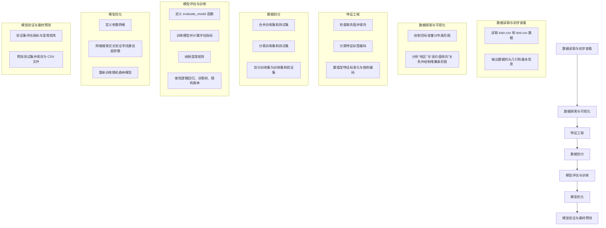

# 数据处理与分析流程

```mermaid
graph TD
    A[数据读取与初步查看] --> B[数据探索与可视化]
    B --> C[特征工程]
    C --> D[数据划分]
    D --> E[模型评估与训练]
    E --> F[模型优化]
    F --> G[模型验证与最终预测]

    subgraph 数据读取与初步查看
        A1[读取 train.csv 和 test.csv 数据]
        A2[输出数据的头几行和基本信息]
    end
    
    subgraph 数据探索与可视化
        B1[绘制目标变量分布条形图]
        B2[分析“地区”与“高价值倾向”关系并绘制堆叠条形图]
    end

    subgraph 特征工程
        C1[检查缺失值并填充]
        C2[分类特征标签编码]
        C3[数值型特征标准化与独热编码]
    end

    subgraph 数据划分
        D1[合并训练集和测试集]
        D2[分离训练集和测试集]
        D3[划分训练集为训练集和验证集]
    end

    subgraph 模型评估与训练
        E1[定义 evaluate_model 函数]
        E2[训练模型并计算评估指标]
        E3[绘制混淆矩阵]
        E4[使用逻辑回归、决策树、随机森林]
    end

    subgraph 模型优化
        F1[定义参数网格]
        F2[网格搜索交叉验证寻找最佳超参数]
        F3[重新训练随机森林模型]
    end

    subgraph 模型验证与最终预测
        G1[验证集评估指标与混淆矩阵]
        G2[预测测试集并保存为 CSV 文件]
    end
```

将上述内容保存为 Markdown 文件并在支持的工具中查看，可生成清晰的流程图。
